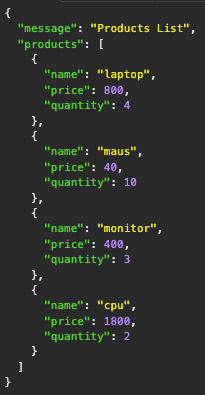
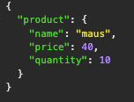
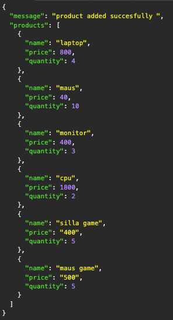
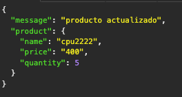
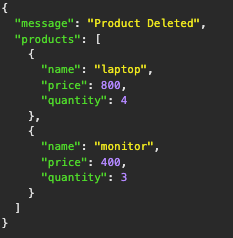

# Rest Api con flask 
para levanta el proyecto 
```bash 
git clone 
```
```bash
python3 app.py 
```

## Recordando para que sirven 
```py 
from flask import Flask, jsonify, request
```
el jsonify es para crear string en json 
y el request para peticiones REST
## Los endpoints para usar esta api 
## para mostrar todos los productos - get
```route
http://localhost:3000/products
``` 
### se debería mostra asi: 



## para mostrar un solo producto - get
```route
http://127.0.0.1:3000/products/maus
```
### se debería mostra asi: 


## para agregar un producto - post
```route 
http://127.0.0.1:3000/products
```
seguido desde el postman o imsomia, ingresar los datos con esta estructura 
```json 
{
	"name": "maus game",
	"price": "500",
	"quantity": 5
}
```
### se debería mostra asi: 


## para actualizar producto - put
```route
http://127.0.0.1:3000/products/cpu
```
seguido desde el postman o imsomia, ingresar los datos con esta estructura
```json
{
	"name": "cpu2222",
	"price": "400",
	"quantity": 5
}
```
### se debería mostra asi: 


## para eliminar un producto - delete 
```route
http://127.0.0.1:3000/products/maus
```
seguido desde el postman o imsomia desde la ruta el nombre del producto que quiere eliminar 
### se debería mostra asi: 



